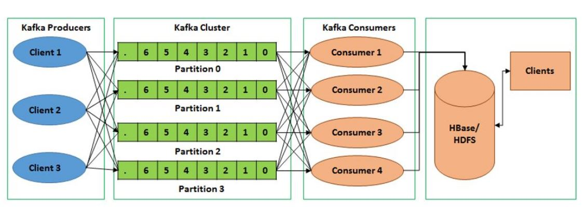
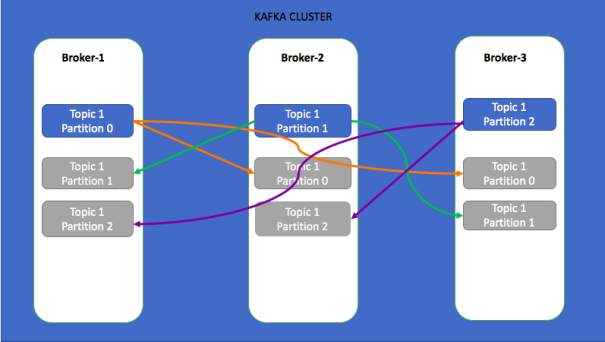

# Apache Kafka Playground [](https://travis-ci.com/pedrovgs/KafkaPlayground)

Playground used to learn and experiment with [Apache Kafka](https://kafka.apache.org/) using [Scala](https://www.scala-lang.org/). Do you want to learn Apache Kafka? Try to resolve the proposed exercises :smiley:


Apache Kafka is used for building real-time data pipelines and streaming apps. It is horizontally scalable, fault-tolerant, wicked fast, and runs in production in thousands of companies.


This highly-scalable publish-subscribe messaging system that can serve as the data backbone in distributed applications. With Kafka’s Producer-Consumer model it becomes easy to implement multiple data consumers that do live monitoring as well persistent data storage for later analysis.

## Exercises

This table contains all the exercises resolved in this repository sorted by goals with links for the solution and the specs.

| # | Goal | Statement | Code | Tests |
| - | ---- | --------- | ---- | ----- |
| 1 | Learn how to handle topics using ``kafka-cli`` tools. | [CLI TOPICS 101.](./statements/CLI_TOPICS_101.md) | [CLI TOPICS 101.](./statements/cli_statements_solutions/CLI_TOPICS_101.md) | - |
| 2 | Learn how to produce and cosume messages using ``kafka-cli`` tools. | [CLI PRODUCER AND CONSUMER.](./statements/CLI_PRODUCER_CONSUMER.md) | [CLI PRODUCER AND CONSUMER.](./statements/cli_statements_solutions/CLI_PRODUCER_CONSUMER.md) | - |
| 3 | Learn how to use consumers in group using ``kafka-cli`` tools. | [CLI CONSUMERS GROUP.](./statements/CLI_CONSUMERS_GROUPS.md) | [CLI CONSUMERS GROUP.](./statements/cli_statements_solutions/CLI_CONSUMERS_GROUPS.md) | - |
| 4 | Learn how to use kafka consumer groups ``kafka-cli`` tools. | [CLI CONSUMERS GROUPS 2.](./statements/CLI_CONSUMERS_GROUPS_2.md) | [CLI CONSUMERS GROUPS 2.](./statements/cli_statements_solutions/CLI_CONSUMERS_GROUPS_2.md) | - |
| 5 | Learn how to use Kafka Tool app. | [KAFKA TOOL.](./statements/KAFKA_TOOL.md) | - | - |
| 6 | Learn how to create a Kafka producer written in Scala. | [SCALA PRODUCER.](./statements/SCALA_PRODUCER.md) | [TheFlashTweetsProducer](https://github.com/pedrovgs/KafkaPlayground/blob/master/scala/src/main/scala/com/github/pedrovgs/kafkaplayground/flash/TheFlashTweetsProducer.scala) | [TheFlashTweetsProducerSpec](https://github.com/pedrovgs/KafkaPlayground/blob/master/scala/src/test/scala/com/github/pedrovgs/kafkaplayground/flash/TheFlashTweetsProducerSpec.scala) |
| 7 | Learn how to create a Kafka consumer written in Scala. | [SCALA CONSUMER.](./statements/SCALA_CONSUMER.md) | [TheFlashTweetsConsumer](https://github.com/pedrovgs/KafkaPlayground/blob/master/scala/src/main/scala/com/github/pedrovgs/kafkaplayground/flash/TheFlashTweetsConsumer.scala) | [TheFlashTweetsConsumerSpec](https://github.com/pedrovgs/KafkaPlayground/blob/master/scala/src/test/scala/com/github/pedrovgs/kafkaplayground/flash/TheFlashTweetsConsumerSpec.scala) |
| 8 | Kafka Connect. | [KAFKA CONNECT.](./statements/KAFKA_CONNECT.md) | - | - |

## Kafka F.A.Qs:



* **What does the number of partitions per topic represents?**

The number of consumers we can have getting Kafka messages at concurrently.

* **Can we increase the number of partitions per topic once it is created?**

Yes, but take into account that the keys distributions are going to change. This also breaks the keys ordering guarantees.

* **What happens if we add more partitions?**

The more partitions we have and the more consumers we have, the better throughput we get. The numbrer of partitions also let's you distribute the brokers load. This will also increase the load in our Zookeeper cluster.

* **How many partitions per topic show we create?**

This is not a silver bullet formula, but we could use the following rules as a single rule of thumb. 

For small clusters, less than 12 brokers. Partitions = 2 x number of brokers.
For big clusters, more than 11 brokers. Partitions = number of brokers.

If the topic is going to be consumed by a fixed number of consumers, you'll need at least as brokers and partitions as consumers you have.

**The most important rule is to measure the cluster throughput in consumers and producers and review if we need to improve our system.**



* **Why the replication factor is so important for us?**

This value let us ensure our messages are going to continue being consumes even if the leader broker falls.

* **Can we increase the replication factor once the topic is created?**

Yes, but his might decrease the performance of the cluster while the migration takes effect.

* **What replication factor should I use?**

It should be at least 2, usually 3 and maximum 4. If your replication factor is ``n`` these are the result's you'll get:

* n - 1 brokers can fail.

Remember that a high replication factor increases the network latency due to the acks confiuration and also needs more disk.

If the replication factor is generating a performance issue review if you can get a better borker instead of reducing the replication factor.

**Never use 1 as replication factor. If you do this and your borker goes down...you won't be able to recover your data**.

* **Is there any naming convention for our Kafka topics?**

[Here](https://medium.com/@criccomini/how-to-paint-a-bike-shed-kafka-topic-naming-conventions-1b7259790073) you can find some. This could be an example ``<app type>.<dataset name>.<data>``. Remember you can't rename a topic, so pick a good naming convention fron the begining.

## Install Apache Kafka with Docker

Thanks to the usage of docker we can simplify the usage of Kafka for this playground. You just need to move to the folder named ``docker`` and start all the required instances.

```
cd docker
docker-compose up
```

This might take a while, so I'd recommend you to grab a :coffee:.

After that, a Zookeeper instance and a Kafka broker will be initialized. Once the instances are up and running you can test the execution by running the following comands:

```
# Create topic
docker-compose exec broker kafka-topics --create --zookeeper zookeeper:2181 --replication-factor 1 --partitions 1 --topic users 

# Start posting messages to the already created topic
docker-compose exec broker kafka-console-producer --topic=users --broker-list localhost:9092

# Start listening messages from the already created tpic
docker-compose exec broker kafka-console-consumer --bootstrap-server localhost:9092 --topic users --from-beginning
```

**If everything goes ok, you'll see how the consumer shows every message the producer posted.**

If you want to access this information from outside the Docker container you can use the ip and port listed when executing ``docker-compose ps``.

```
  Name               Command            State                        Ports
------------------------------------------------------------------------------------------------
broker      /etc/confluent/docker/run   Up      0.0.0.0:29092->29092/tcp, 0.0.0.0:9092->9092/tcp
zookeeper   /etc/confluent/docker/run   Up      0.0.0.0:2181->2181/tcp, 2888/tcp, 3888/tcp
```

The broker is accessible from the ip address ``localhost:29092``. If you install the Kafka binaries locally (you can read the following section) or you want to connect from any code you wrote, you can use that ip address and port. This is an example of how to use a console producer and consumer from outside the Docker container.

```
# Start posting messages to the already created topic
kafka-console-producer --topic=users --broker-list localhost:29092

# Start listening messages from the already created tpic
kafka-console-consumer --bootstrap-server localhost:29092 --topic users --from-beginning
```

## Install Apache Kafka (local)

The best way to install the latest version of the Kafka server on OS X and to keep it up to date is via Homebrew.

```
brew install kafka
```

The above commands will install a dependency called zookeeper which is required to run kafka. Start the zookeeper service and don't close the terminal where the following command is executed.

```
zookeeper-server-start /usr/local/Cellar/kafka/2.0.0/libexec/config/zookeeper.properties
```

While Zookeeper is running, Start the kafka server which handles both producer and consumer parts.

```
kafka-server-start /usr/local/etc/kafka/server.properties
```

In a new terminal, create a new topic.

```
kafka-topics --create --zookeeper localhost:2181 --replication-factor 1 --partitions 1 --topic test
```

From another terminal, list the topics already created.

```
kafka-topics --list --zookeeper localhost:2181
```

If you followed the above steps properly you should see how the result of the last command executed prints ``test`` in your terminal. **We are now ready to test the producers and consumers in order to test our installation**

From any terminal execute the following command that will let you send messages to any Kafka cluster you can reach using the already created topic:

```
kafka-console-producer --broker-list localhost:9092 --topic test
This is a message
This is another message
```

From another terminal execute this command and you'll see how the messages sent from the prodcuer in the previous step will be read by the consumer we've just created:

```
kafka-console-consumer --bootstrap-server localhost:9092 --topic test --from-beginning
```   

## Running Scala code

Inside the scala folder you'll find a sbt project using Kafka intensively. This project uses a Twitter client as data source so configuring the access to this platform throug this API is needed. To do this you only need to create a Twitter app from [this page](https://apps.twitter.com) and add a ``src/main/resources/application.conf`` file to your ``scala`` folder with the following content:

```
twitter {
  consumer {
    key = "my-consumer-key"
    secret = "my-consumer-secret"
  }
  access {
    key = "my-access-key"
    secret = "my-access-secret"
  }
}
```

Developed By
------------

* Pedro Vicente Gómez Sánchez - <pedrovicente.gomez@gmail.com>

<a href="https://twitter.com/pedro_g_s">
  
</a>
<a href="https://es.linkedin.com/in/pedrovgs">
  
</a>

License
-------

    Copyright 2017 Pedro Vicente Gómez Sánchez

    Licensed under the GNU General Public License, Version 3 (the "License");
    you may not use this file except in compliance with the License.
    You may obtain a copy of the License at

       http://www.gnu.org/licenses/gpl-3.0.en.html

    Unless required by applicable law or agreed to in writing, software
    distributed under the License is distributed on an "AS IS" BASIS,
    WITHOUT WARRANTIES OR CONDITIONS OF ANY KIND, either express or implied.
    See the License for the specific language governing permissions and
    limitations under the License.
